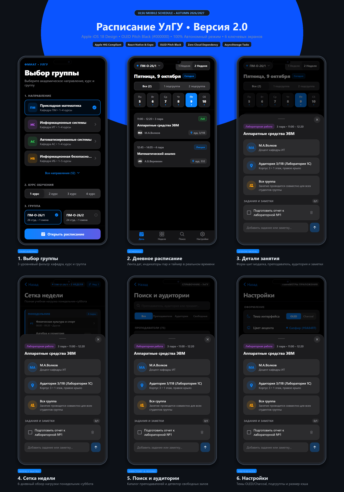

# 📱 Расписание УлГУ (UlsuNotSmart v2.0.0)

<div align="center">
  
  
  <br />

  [](https://github.com/Ak417ytrfg/ulsu-app/releases)
  [](https://reactnative.dev/)
  [](https://expo.dev/)
  [](https://www.typescriptlang.org/)
  [](https://developer.apple.com/design/human-interface-guidelines/)
  [](LICENSE)
</div>

---

## 📖 Обзор проекта

**Расписание УлГУ** — высокопроизводительное мобильное приложение для студентов и преподавателей факультета математики, информационных и авиационных технологий (ФМИАТ) Ульяновского государственного университета.

Версия **v2.0.0** представляет собой полный редизайн приложения в соответствии со стандартами **Apple iOS 18 Human Interface Guidelines**, палитрой **OLED Pitch Black** (`#000000`), тактильной отдачей **Haptic Feedback** и расширенной архитектурой из **6 ключевых экранов**.

---

## 📱 Сводка экранов и возможностей

| Экран | Скриншот | Ключевой функционал | Реализованные компоненты |
|:---|:---:|:---|:---|
| **1. Выбор группы** | [Просмотр](assets/screenshots/1_group_selection.png) | 3-уровневая селекция (Кафедра → Курс → Группа), разворачиваемый каталог 12 направлений, метаданные групп. | `GroupSelectionScreen.tsx`, `LinearGradient`, чипы с тактильным откликом |
| **2. Дневное расписание** | [Просмотр](assets/screenshots/2_schedule_day.png) | Карусель дат с индикаторами нагрузки, переключатель четности недель, бейджи типов занятий, таймер и статус пары в реальном времени. | `ScheduleScreen.tsx`, карусель дней, `PulseDot`, фильтр подгрупп |
| **3. Детали занятия** | [Просмотр](assets/screenshots/3_lesson_detail.png) | Адаптивный Form Sheet модал с жестом смахивания, карточки преподавателя и аудитории, чеклист домашних заданий и персональных заметок. | `LessonDetailSheet.tsx`, `PanResponder`, `AsyncStorage` задачи |
| **4. Сетка недели** | [Просмотр](assets/screenshots/4_weekly_grid.png) | Компактная 6-дневная матрица нагрузки (Пн–Сб) для быстрой оценки недели, подсчет пар, цветовое кодирование дней. | `WeeklyGridScreen.tsx`, расчет недельной нагрузки, бейджи пар |
| **5. Поиск и аудитории** | [Просмотр](assets/screenshots/5_search_rooms.png) | Справочник преподавателей с расчетом нагрузки, монитор занятости аудиторий в реальном времени, всплывающее расписание кабинетов. | `SearchScreen.tsx`, кешированные алгоритмы поиска $O(1)$, статус-точки |
| **6. Настройки** | [Просмотр](assets/screenshots/6_settings.png) | Переключение темы (OLED / Charcoal), выбор подгруппы по умолчанию, индикатор офлайн-кэша, сброс группы с подтверждением. | `SettingsScreen.tsx`, системные тумблеры `Switch`, статус синхронизации |

---

## 🛠️ Технологический стек и архитектура

### Дизайн-система Apple HIG & Оптимизация OLED
- **Цветовая палитра**: Абсолютно черный базовый фон `#000000` для максимальной экономии энергии на OLED/Super Retina дисплеях. Поднятые поверхности карточек `#1C1C1E` и сгруппированные списки `#2C2C2E`.
- **Эргономика сенсорных зон**: Все кнопки, чипы и ячейки соответствуют стандарту Apple HIG $\ge 44 \times 44$ pt (прямой размер или расширение через `hitSlop`).
- **Стекло и размытие**: Нативная панель навигации с эффектом акрилового стекла через `expo-blur` (`UIBlurEffectStyleSystemChromeMaterialDark`).
- **Тактильная отдача**: Селекторы, переключатели и подтверждения сопровождаются откликом `expo-haptics` (`Light`, `Medium`, `NotificationFeedbackType.Warning`).

### Двухуровневая гибридная архитектура (Two-Tier Hybrid Architecture)
```text
┌─────────────────────────────────┐       ┌─────────────────────────────────┐
│   Static Normalized Dataset     │       │     Local Device Storage        │
│   src/data/schedule.json        │       │         AsyncStorage            │
├─────────────────────────────────┤       ├─────────────────────────────────┤
│ • 37 академических групп        │       │ • Выбранная группа              │
│ • 1 193 нормализованных занятия │       │ • Подгруппа по умолчанию        │
│ • Данные преподавателей и залов │       │ • Личные задачи и заметки к пар.│
│ • 100% Офлайн без задержек      │       │ • Настройки темы и интерфейса   │
└─────────────────────────────────┘       └─────────────────────────────────┘
```

---

## 🚀 Установка и запуск

### Требования
- **Node.js** $\ge 18.0.0$
- **npm** или **yarn**
- Приложение **Expo Go** на физическом устройстве (iOS / Android) или симулятор

### 1. Клонирование репозитория
```bash
git clone https://github.com/Ak417ytrfg/ulsu-app.git
cd ulsu-app
```

### 2. Установка зависимостей
```bash
npm install
```

### 3. Запуск сервера разработки
```bash
npx expo start
```
- Для запуска на **iOS**: нажмите `i` в терминале или отсканируйте QR-код в приложении камеры.
- Для запуска на **Android**: нажмите `a` в терминале или отсканируйте QR-код в приложении Expo Go.
- Для запуска в **веб-браузере**: нажмите `w` в терминале.

### 4. Проверка типов и сборка
```bash
# Статическая проверка типов TypeScript
npx tsc --noEmit

# Экспорт статического веб-бандла
npx expo export -p web
```

---

## 📄 Лицензия

Проект распространяется под лицензией [MIT](LICENSE).
Разработано для студентов и преподавателей Ульяновского государственного университета.
